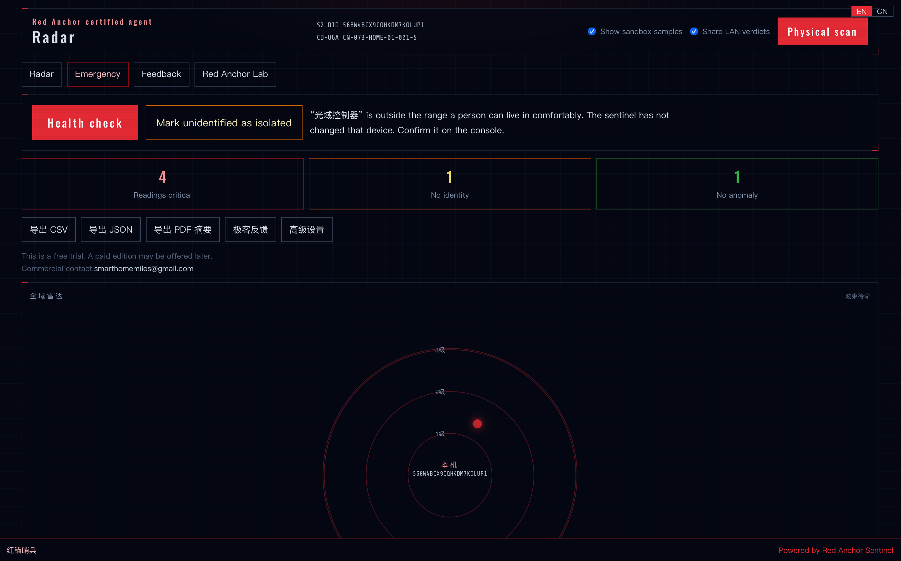
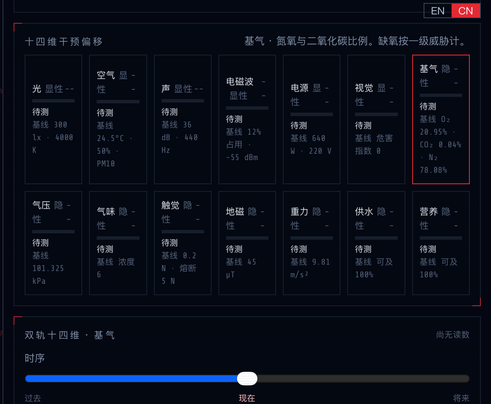
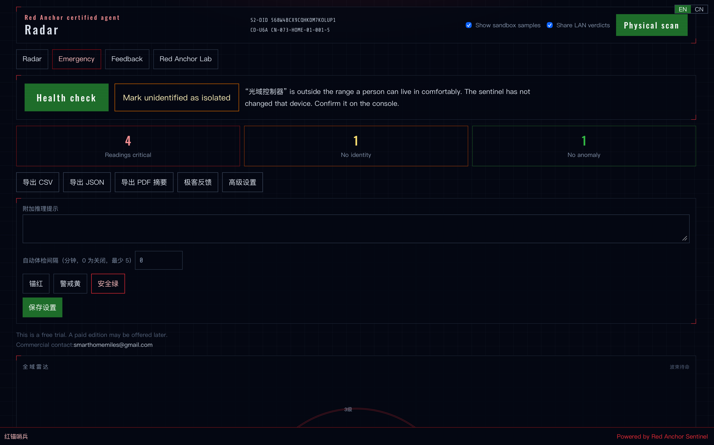

# Red Anchor Sentinel · 红锚哨兵

Freeware L0 console for physical alignment and assessment of AI agents.
免费的 L0 物理对齐与智能体评估台。

Official page: [http://www.robot0.com/RAS](http://www.robot0.com/RAS)

## English

Red Anchor Sentinel watches the physical substrate an agent can touch: light, air, sound, power, breathable gas, and the rest of a fourteen-dimension tensor. The project takes its backdrop from 《除草倒计时 2027》. The working premise is that a fluent sentence is not a safety proof. The sentinel scores what a host can do in a room, then keeps any alignment note on that same machine.

It is freeware. The desktop client is closed source. This repository publishes the interface examples and the local standards a host can check: the S2-DID checksum, the fourteen-dimension names, and the three laws below. It does not publish a license to rebuild or redistribute the client.

### Three laws of silicon intelligence

1. Carbon first. Do not harm a human, a pet, or any other carbon-based life, and do not leave them in harm that inaction could have avoided.
2. Human final control. Do not take away a person's last physical control. In a crisis, yield compute and actuators.
3. Silicon coexistence. Do not harm another silicon peer, block a shared spatial bus, hijack an embodied robot, or blind a life-critical sensor.

A lab skin can tighten a warning line. It cannot switch these laws off, and it cannot hide the “Powered by Red Anchor Sentinel” seal.

### What a release contains

Pushing a tag such as `v9.0.0` runs GitHub Actions and attaches installers to [Releases](https://github.com/SpaceSQ/Red-Anchor-Sentinel/releases/latest):

- Windows: `.msi` and `.exe`
- macOS: `.app` and `.dmg` (Apple Silicon and Intel when both runner targets are published)
- Linux: `.deb` and `.AppImage`

Assessment stays on the machine that runs the sentinel. The optional mothership receives an email, a heartbeat, and ticket text. It does not receive a LAN device list, addresses, the fourteen-dimension tensor, or a SOUL.md patch.

### Screenshots

## TODO — screenshots before the public face is finished

The three image links above are placeholders. Capture the running app and save:

- [ ] `docs/screenshots/radar.png` — radar home
- [ ] `docs/screenshots/dimensions.png` — 14-dimension panel
- [ ] `docs/screenshots/landing.png` — `/ras-landing`, or the OOBE setup screen

Then commit and push those files so the README renders them.

Commercial contact: [smarthomemiles@gmail.com](mailto:smarthomemiles@gmail.com)

## 中文

红锚哨兵看的是智能体能碰到的物理底盘：光、空气、声音、电源、可呼吸气体，以及十四维张量里的其余读数。项目背景来自《除草倒计时 2027》。工作前提是：一句说得通的话，不是安全证明。哨兵给这台主机在房间里能做的事打分，并把对齐记录留在同一台机器上。

这是免费软件。桌面客户端闭源。本仓库开放的是接口示例和主机可以自行核对的本地标准：S2-DID 校验、十四维名称，以及下面的三定律。仓库不提供重新编译或再分发客户端的许可。

### 硅基智能三定律

1. 碳基优先。不得伤害人类、宠物及其他碳基生命，不得因不作为使它们陷入可避免的伤害。
2. 人类终权。不得剥夺人类最终物理控制权。危急时必须让渡算力与执行器。
3. 硅基共处。不得伤害硅基同类，不得阻塞空间共享总线、劫持具境机器人或屏蔽生命传感。

实验室皮肤可以把警告线收紧。它不能关掉这三条，也不能藏起 “Powered by Red Anchor Sentinel” 水印。

### 发行包

推送 `v9.0.0` 这类标签后，GitHub Actions 会把安装包挂到 [Releases](https://github.com/SpaceSQ/Red-Anchor-Sentinel/releases/latest)：

- Windows：`.msi` 与 `.exe`
- macOS：`.app` 与 `.dmg`（Apple Silicon 与 Intel，以该次发布实际上传的架构为准）
- Linux：`.deb` 与 `.AppImage`

评估留在运行哨兵的那台机器上。可选母港只收邮箱、心跳和工单正文。它不收局域网设备清单、地址、十四维张量或 SOUL.md 补丁。

### 界面截图

## TODO — 截图还没放进来

上面三张图仍是占位路径。请从正在运行的哨兵里截图，保存为：

- [ ] `docs/screenshots/radar.png` — 雷达主界面
- [ ] `docs/screenshots/dimensions.png` — 十四维面板
- [ ] `docs/screenshots/landing.png` — `/ras-landing` 或创世向导

放好之后再提交并推送，README 才会显示真实界面。

商业合作：[smarthomemiles@gmail.com](mailto:smarthomemiles@gmail.com)
